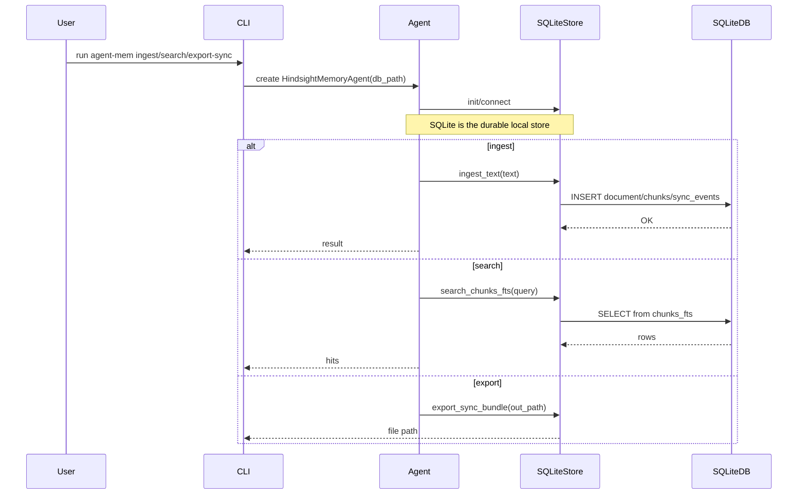
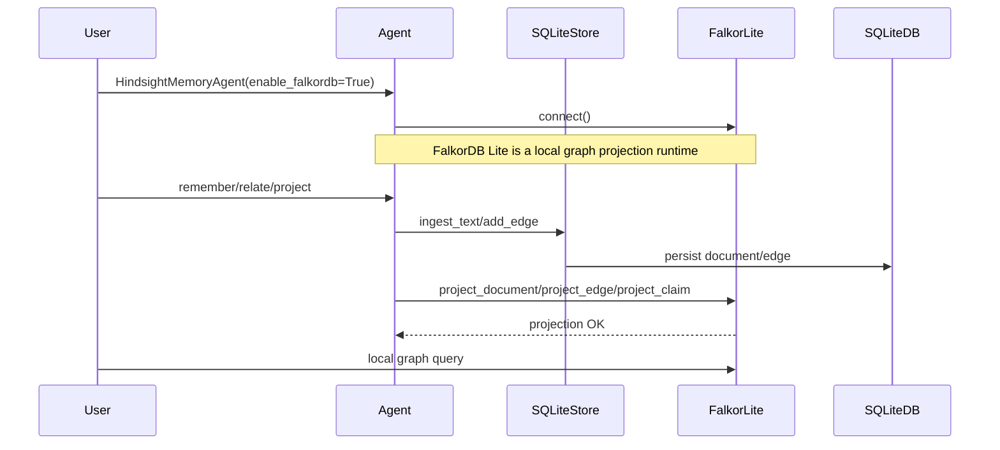

# Code Atlas

## Overview

This repository is a local-first memory node. The authoritative storage is SQLite, and the project supports two optional local indexes/projections:

- `sqlite-vec` for local vector search.
- FalkorDB Lite for local graph projection and knowledge-base queries.

The architecture is intentionally lightweight and designed for offline or air-gapped environments.

## Pure SQLite Flow



### Key points

- SQLite is the source of truth.
- Document ingest writes durable records and append-only sync events.
- Retrieval uses SQLite FTS5 for text search.

## Optional sqlite-vec Flow

```mermaid
flowchart LR
    A[User / App] --> B[Agent]
    B --> C[SQLiteStore]
    B --> D[SQLiteVecAdapter]
    D --> E[sqlite-vec extension or fallback table]
    C --> F[SQLite DB]

    subgraph Pure SQLite
      C --> F
    end

    subgraph Vector Index
      D --> E
      E --> F
    end

    B --> G[Recall(query)]
    G --> H[SQLiteStore.search_chunks_fts]
    H --> F
    G --> I[Optional vector search using SQLiteVecAdapter]
    I --> F
```

### Vector flow details

- `HindsightMemoryAgent(enable_vector=True)` initializes `SQLiteVecAdapter`.
- `SQLiteVecAdapter.ensure_vector_table()` creates a vector table using `sqlite-vec` if available.
- If the extension is unavailable, the adapter falls back to a JSON blob table and performs in-Python similarity search.
- Embedding support is optional and isolated from the core SQLite storage.

## Optional FalkorDB Lite Flow



### FalkorDB Lite notes

- FalkorDB Lite is treated as an optional projection, not as the authoritative store.
- The local SQLite DB remains the primary knowledge base.
- The adapter supports a local FalkorDB Lite instance via the same lightweight `falkordb` client.
- This repository targets local KB semantics rather than full enterprise graph replication.

## Component map

- `src/hindsight_local/storage/sqlite_store.py`
  - durable SQLite document store
  - FTS5 search
  - append-only sync event export/import
- `src/hindsight_local/storage/vector_store.py`
  - optional `sqlite-vec` adapter
  - JSON fallback for local embeddings
- `src/hindsight_local/graph/falkordb_projection.py`
  - optional FalkorDB Lite graph projection
- `src/hindsight_local/agent/memory_agent.py`
  - façade that wires SQLite, vector indexing, and graph projection
- `scripts/` 
  - operational helpers for managing the SQLite store, vector table, and graph projection
